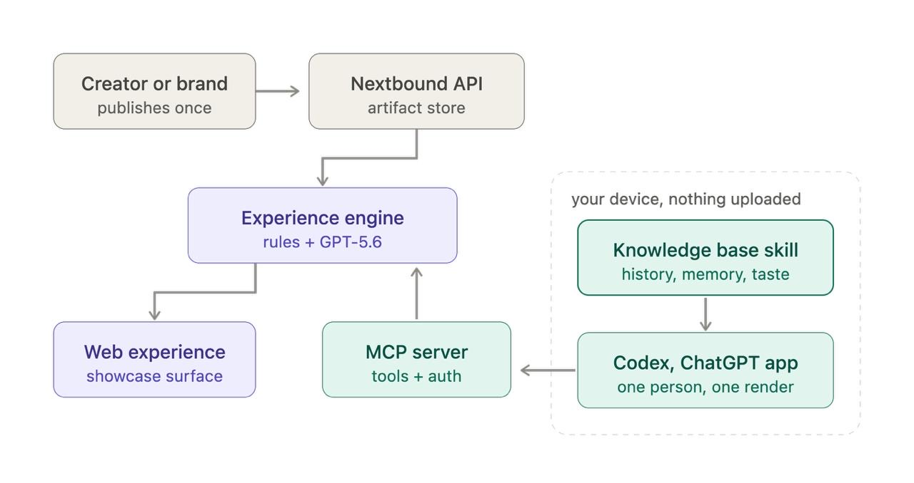

# Nextbound — content, made for you

**Track:** Apps for your life

**Live demo:** [nextbound-adaptive-media.netlify.app](https://nextbound-adaptive-media.netlify.app/nextbound.html?scenario=procedural-loop)
**MCP endpoint:** `https://nextbound-adaptive-media.netlify.app/mcp`

Nextbound is an MCP for ChatGPT and Codex. It turns one piece of content into a
version made for you, rendered by GPT-5.6 from a knowledge base that stays on
your device.

For this demo, Luna shares one original sneaker artifact. Rather than treating
it as an ad recommendation, Nextbound preserves its attribution and identity
while changing the *way it is experienced* for three people:

| Profile | Context | Resulting experience |
| --- | --- | --- |
| Alex | CEO, tech company | Executive Series — travel, focus, performance |
| Camille | Artistic director | Atelier Édition — form, softness, feeling |
| Maya | Developer | Studio Drop — daily build, flow, durability |

The viewer can open the full personal artifact, switch profiles, and inspect
the original creator artifact at any point. The artifact is therefore a shared
object with many relevant presentations — not three disconnected campaigns.

## Why this matters

Creators and brands currently face a bad trade-off: publish one generic asset
that feels irrelevant to most people, or produce many costly bespoke assets
that fragment the creator’s voice. Nextbound proposes a third path:

1. A creator publishes one attributable source artifact.
2. An MCP tool resolves a deterministic, contextual experience for a recipient.
3. The recipient sees a presentation tuned to their role and rhythm.
4. The original remains explicitly available, so personalization never hides
   where the work came from.

This is useful for creator-led product launches, travel and lifestyle media,
community drops, and any situation where one message needs to travel across
distinct audiences without becoming generic.

## What makes the project non-trivial

Nextbound is not a static landing page. It includes:

- A **Streamable HTTP MCP server** with a live `/mcp` endpoint.
- A compact **MCP Apps UI resource** at `ui://nextbound/afterlight.html`,
  attached to the `generate_experience` tool.
- A deterministic personalization engine with public intents, creator profiles,
  personas, experience sessions, and Nextbound actions.
- An interactive React artifact UI: staged delivery, generated experience,
  persona switching, a full-artifact lightbox, and creator-origin view.
- Embedded artwork in the MCP HTML resource, so the visual experience works
  inside an MCP host rather than depending on the public site’s asset paths.
- Unit coverage for the service and procedural runtime.

The demo is deliberately deterministic: the same Intent + persona produces the
same experience. That makes it testable, inspectable, and suitable for a jury
demo without hidden model variance.

## Architecture

```text
Creator artifact (Luna)
        │
        ▼
Adaptive Media / Nextbound MCP server
  ├─ creator Intent + attribution
  ├─ recipient persona context
  └─ generate_experience(intentId, personaId)
        │
        ▼
ui://nextbound/afterlight.html
  ├─ Alex / Camille / Maya presentation
  ├─ full personal artifact
  └─ original creator artifact
```



## Run locally

### Prerequisites

- Node.js 20+
- npm

### Install, verify, and launch

```bash
npm install
npm run typecheck
npm test
npm run build:afterlight
npm run verify:afterlight
npm start
```

The local MCP server starts at `http://127.0.0.1:3000/mcp`.

For the web UI, run this in a second terminal:

```bash
npm run dev
```

Then open `http://127.0.0.1:4175/nextbound.html`.

To build the production MCP function as well:

```bash
npm run build:netlify-fn
```

No API key, database, or sample-data download is needed: seeded creator,
persona, and experience data ship with the repository.

## Test the MCP integration

### Codex

Add this to your local Codex MCP configuration:

```toml
[mcp_servers.nextbound]
url = "http://127.0.0.1:3000/mcp"
```

For the hosted demo, replace the URL with:

```text
https://nextbound-adaptive-media.netlify.app/mcp
```

Start a fresh task and ask:

> Generate Luna’s experience for Alex.

The `generate_experience` tool returns the AFTERLIGHT UI resource. Switch to
Camille and Maya to see how one source artifact becomes three presentations.

### ChatGPT

In a workspace with Developer mode / custom MCP apps enabled, create an app
with the hosted MCP URL above, select **No authentication** for this public
demo, and scan the tools. Start a new chat, select the app, and use the same
prompt: `Generate Luna’s experience for Alex.`

ChatGPT custom MCP availability depends on plan and workspace permissions.
OpenAI’s current developer-mode instructions are available in the
[official Help Center](https://help.openai.com/fr-fr/articles/12584461).

## Judge demo path (under 3 minutes)

1. Open the live web demo and show the incoming artifact from Luna.
2. Press **nextbound me** to generate Alex’s experience.
3. Open Alex’s artifact and then **View creator’s original artifact** to show
   attribution is preserved.
4. Switch to Camille and Maya: same source, clearly different contexts and
   visual languages.
5. Open the MCP endpoint in a ChatGPT/Codex setup and invoke
   `generate_experience` to show that the visual is delivered as an MCP UI,
   not merely linked from a website.

## How Codex and GPT-5.6 were used

This project was built iteratively with Codex using GPT-5.6. Codex accelerated
the work in the places that usually slow down a prototype:

- **System design:** translated the product premise into a creator Intent,
  recipient personas, deterministic experience contracts, and MCP tool schema.
- **Implementation:** built and connected the React visual artifact, the
  Streamable HTTP MCP transport, UI resource metadata, Netlify deployment, and
  production build pipeline.
- **Design iteration:** integrated distinct Alex, Camille, and Maya art
  directions, then made the personal artifact and creator-original views
  interactive and accessible.
- **Debugging and QA:** investigated asset delivery across a static website and
  an MCP-hosted HTML resource; embedded the artwork in the resource, ran
  TypeScript checks, builds, test suites, and live endpoint smoke tests.
- **Product decisions:** kept Luna’s original artifact visible by design,
  rejecting recommendation-style copy so the experience demonstrates shared
  creator content adapted for different people rather than algorithmic ads.

The result is a working product surface and a deployable protocol integration,
not a prompt-only mockup.

## Evaluation-criteria map

### Technological implementation

The repository contains the MCP server, HTTP transport, deterministic service
layer, React UI, Netlify function, deployment configuration, build scripts,
and tests. The public MCP endpoint has been smoke-tested with `initialize` and
`tools/list`; `generate_experience` advertises the AFTERLIGHT output template.

### Design

The experience has a complete flow: creator delivery → personalization → full
artifact → original attribution → persona comparison. It is runnable locally,
available on the web, and designed to render as an MCP App UI.

### Potential impact

Nextbound gives creators and teams a concrete alternative to generic content
and opaque targeting. It maintains source identity while making media relevant
to a recipient’s actual context.

### Quality of idea

The novelty is not “AI makes another ad.” It is a portable, attributable
creator artifact that compiles into context-sensitive experiences through MCP,
while keeping the original visible and inspectable.

## Repository and license

- Repository: [github.com/42thefrog/adaptivemedia](https://github.com/42thefrog/adaptivemedia)
- License: [Apache-2.0](LICENSE)

## Current demo boundaries

This is a public deterministic demo. It has no user authentication, database,
or persistent user profile. Like/follow/save state is in memory. A production
version would add OAuth, consent, authorization, persistence, audit logs, and
data deletion controls before processing personal data.
